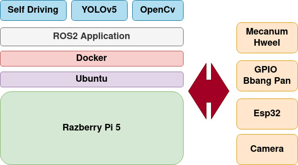
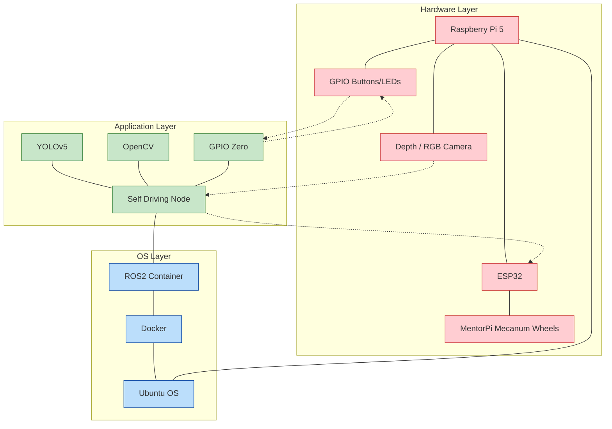
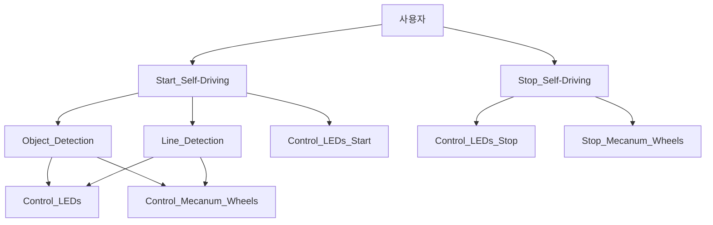
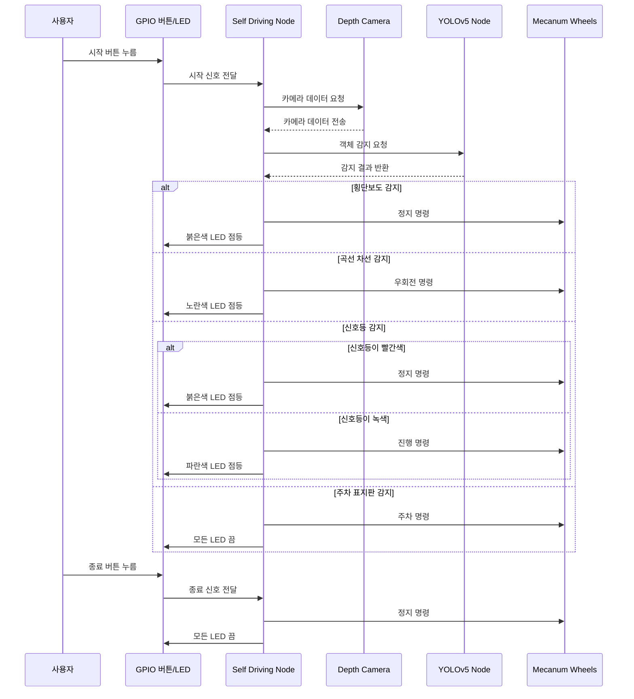

# 자율주행 시스템

## 1. 시스템 아키텍처 개요
```
Raspberry Pi 5와 ROS2 Framework을 중심으로 구성된 임베디드 시스템으로 실시간 이미지 처리와 모터 제어를 통해 자율주행을 구현합니다. 

ROS2 Docker 컨테이너에서 실행되는 자율주행 노드가 카메라 데이터를 처리하고, ESP32를 통해 메카넘 휠을 제어합니다. GPIO를 통한 버튼제어와 LED 점등은 사용자 인터페이스로 활용됩니다.
```

## 2. 계층 구조

### 하드웨어 계층 (Hardware Layer)
- **Raspberry Pi 5**: 메인 컴퓨팅 장치
- **ESP32**: 모터 제어용 마이크로컨트롤러
- **Depth /RGB Camera**: 자율 주행 인식용 카메라 모듈
- **MentorPi Mecanum**: 전방향 이동이 가능한 메카넘 휠
- **버튼/LED 커스텀 빵판**: 사용자 인터페이스 및 상태 표시

### 운영체제 계층 (OS Layer)
- **Ubuntu**: Raspberry Pi 5에 설치된 기본 운영체제
- **ROS2 Docker Container**: 로봇 운영체제 환경

### 애플리케이션 계층 (Application Layer)
- **Self Driving Node**: 자율주행 메인 로직
- **YOLOv5**: 객체 인식 (신호등, 표지판, 횡단보도)
- **OpenCV Lane Detect**: 이미지 처리 및 차선 인식
- **GPIO Zero**: GPIO 인터페이스 라이브러리


## 3. 구성 요소 상호작용
1. **Raspberry Pi와 ESP32**는 UART 또는 I2C로 연결되어 명령을 전달합니다.
2. **Depth / RGB Camera**는 Raspberry Pi에 연결되어 영상 데이터를 제공합니다.
3. **ROS2 환경**에서 각 노드 간 Pub/Sub 구조를 통해 통신합니다.
4. **Self Driving Node**가 카메라 노드를 구독하여 이미지를 받고 분석 후 결과에 따라 ESP32를 통해 메카넘 휠과 LED를 제어합니다.
6. **GPIO Zero** 라이브러리를 통해 시작/종료를 제어하고 **LED**로 상태를 표시합니다.


## 4. 시스템 아키텍처

<div align="center">
    
</div>
<br/>




## 플로우



##  시퀀스 다이어그램

